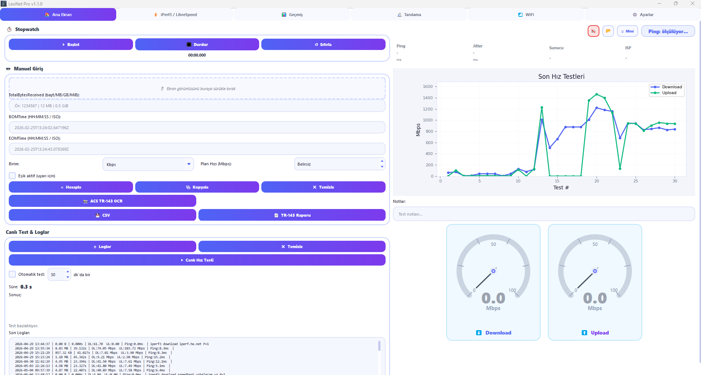
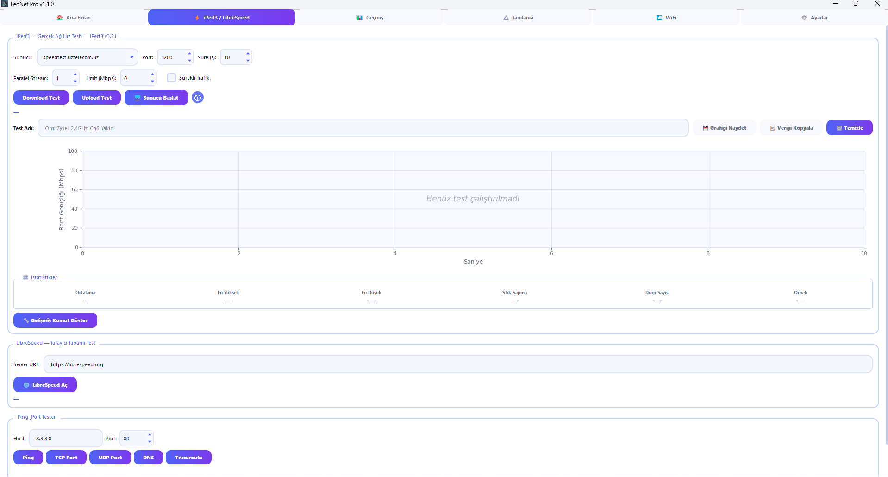
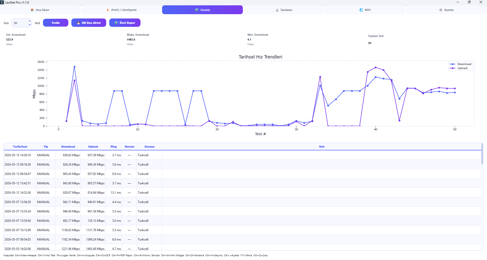
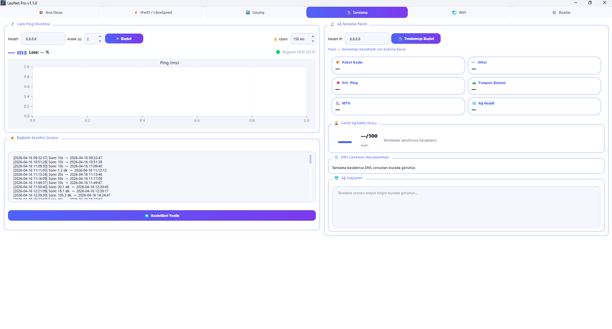
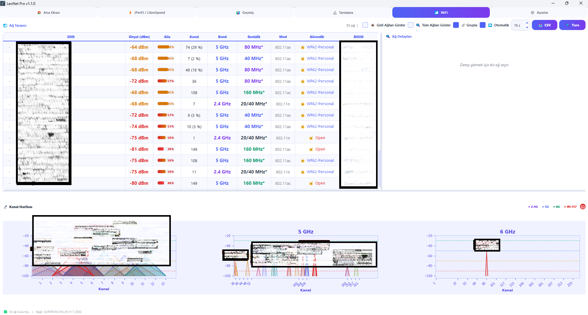
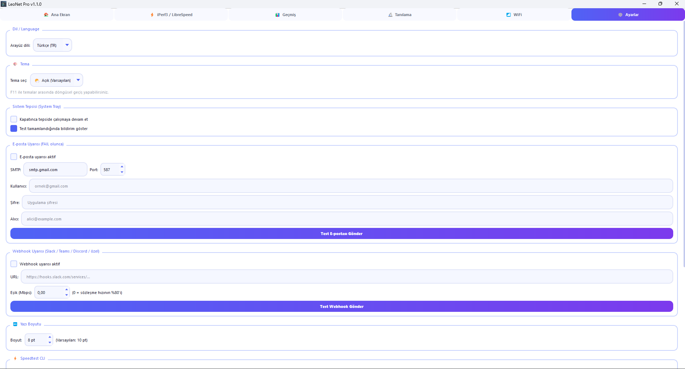

# LeoNet Pro v1.0 🦁

**Network Diagnostics & Internet Speed Test Desktop Application**

LeoNet Pro is a desktop network diagnostics and speed testing application for Windows 10/11. Speed testing, live ping monitoring, Wi-Fi scanning, network diagnostics, iPerf3 throughput testing, and report export — all in a single interface with 6 themes and Turkish/English language support.

---

## Screenshots

---

## Download

👉 **[Download the latest release (LeoNetPro_Setup_v1.0.exe)](https://github.com/burakaslann/LeoNetPro/releases/latest)**

No Python or pip required. Just download and run the setup wizard.

---

## Features

- ⚡ **Internet Speed Test** — Speedtest CLI (Ookla) integration; download, upload and ping results
- 🌐 **iPerf3 Real Throughput Testing** — parallel streams, bandwidth cap, continuous traffic mode
- 🚀 **LibreSpeed Test** — no external binary required
- 📡 **Live Ping Monitor** — real-time graph, alert threshold, beep + tray notification on spike
- ⚠️ **Outage History** — automatic connection outage logging (start time, end time, duration)
- 🔬 **Network Diagnostics** — Ping, Port scan, DNS latency, Traceroute, Packet loss, Jitter, MTU, Bufferbloat
- 🏆 **Network Quality Score** — 0–100 health score calculated from diagnostics results
- 📶 **Wi-Fi Scanner** — SSID list with signal (dBm), channel, band (2.4 / 5 / 6 GHz), security type + channel map
- 🔬 **TR-143 OCR Analysis** — automatic speed value extraction from screenshots via Tesseract OCR
- 📈 **Test History & Charts** — SQLite database, time-series graphs, last 10/50/100/all filter
- 📁 **CSV Export** — full test history in Excel-compatible format
- 📄 **PDF Report** — TR-143 compliant professional PDF report
- 🔔 **Email & Webhook Alerts** — automatic notification on failure (Slack / Teams / Discord / custom)
- 🖥️ **System Tray** — run in background, tray notifications, right-click context menu
- 🎨 **6 Themes** — Light, Dark Navy, Forest Green, Sunset Orange, Cherry Blossom, Midnight Black
- 🇹🇷 🇬🇧 **Turkish / English** — instant language switch, no restart required

---

## Getting Started

### 1. Download Setup

Go to [Releases](https://github.com/burakaslann/LeoNetPro/releases) and download `LeoNetPro_Setup_v1.0.exe`.

Run the setup wizard — iPerf3 and Tesseract OCR are included as optional components.

### 2. Install Speedtest CLI ⚠️

> **Required for internet speed testing**
>
> LeoNet Pro uses **Ookla's Speedtest CLI**.
> This binary is **not bundled** with the application.
>
> Download: https://www.speedtest.net/apps/cli
>
> If Speedtest CLI is not found, the speed test button will be disabled.

### 3. Run

Double-click `LeoNet Pro` from the desktop shortcut or Start Menu.

---

## Keyboard Shortcuts

| Key | Action |
|-----|--------|
| `Ctrl+Enter` | Calculate TR-143 |
| `Ctrl+T` | Start / Stop Speed Test |
| `F5` | Reload Logs |
| `Ctrl+K` | Copy Result to Clipboard |
| `Ctrl+O` | OCR Screenshot Analysis |
| `Ctrl+P` | Generate PDF Report |
| `Ctrl+W` | Clear Form |
| `Ctrl+M` | Toggle Mini Widget |
| `Ctrl+D` | Go to Diagnostics Tab |
| `Ctrl+H` | Go to History Tab |
| `Ctrl+,` | Go to Settings Tab |
| `F11` | Cycle Themes (6 themes) |
| `Ctrl+Q` | Quit Application |

---

## Tabs

| # | Tab | Content |
|---|-----|---------|
| 0 | 🏠 Home | TR-143 calculator, OCR, speed test, live gauges |
| 1 | ⚡ iPerf3 / LibreSpeed | Real throughput & LibreSpeed tests, Ping/Port tester |
| 2 | 📊 History | SQLite history, charts, CSV export |
| 3 | 🔬 Diagnostics | Ping monitor, network diagnostics, outage log |
| 4 | 📶 Wi-Fi | Scanner, 2.4/5/6 GHz channel map |
| 5 | ⚙️ Settings | Language, theme, email/webhook alerts |

---

## System Requirements

- Windows 10 / 11 (64-bit)
- 700 MB disk space (after installation)
- 4 GB RAM (recommended)
- Internet connection (for speed testing)

---

## Third-Party Notices

**Speedtest CLI** — Ookla LLC. Binary not bundled with this software.
LeoNet Pro is not affiliated with, endorsed by, or sponsored by Ookla LLC.
Speedtest® is a registered trademark of Ookla LLC.
https://www.speedtest.net/apps/cli

**iPerf3** — BSD License. https://iperf.fr

**LibreSpeed** — LGPL License. https://librespeed.org

**Tesseract OCR** — Apache License 2.0. https://github.com/tesseract-ocr/tesseract

---

## License

Personal and educational use is free and unrestricted.
Commercial use is prohibited without prior written permission.

See [EULA.txt](EULA.txt) for full terms.

---

## Author

Developed by **Burak Aslan**
