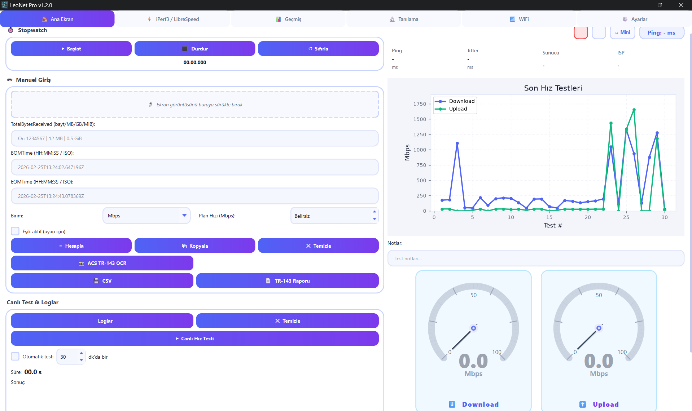
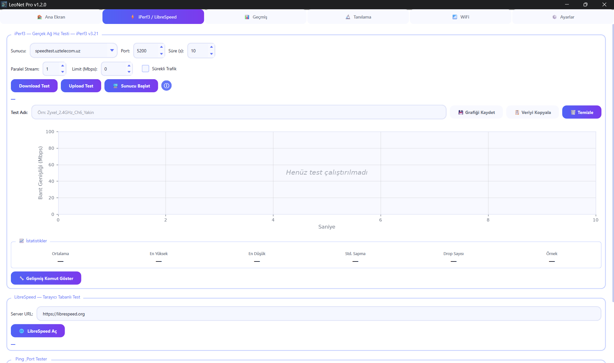
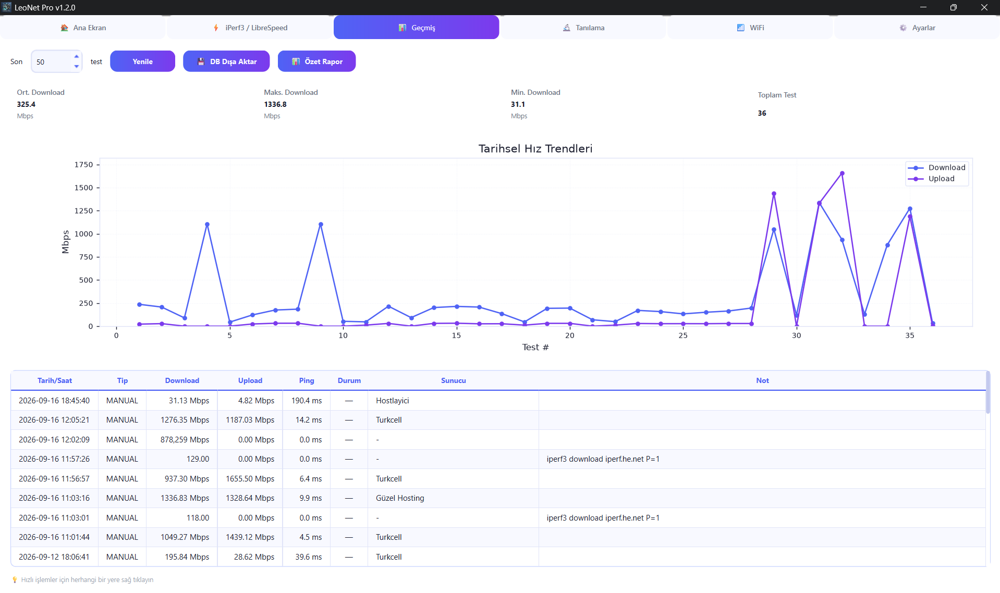
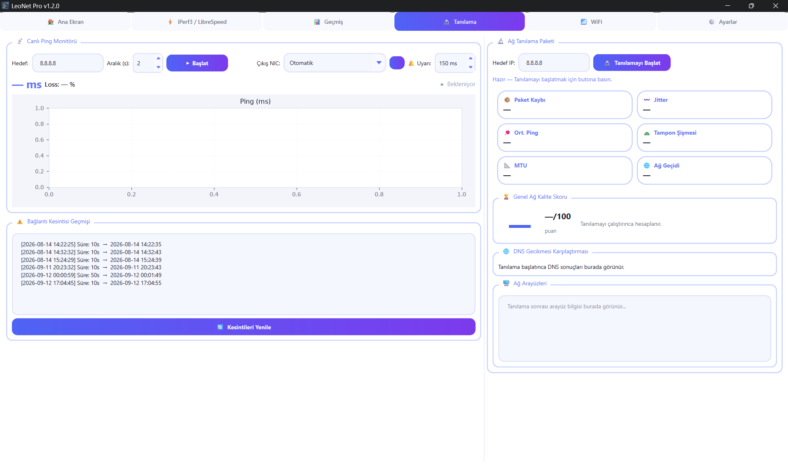
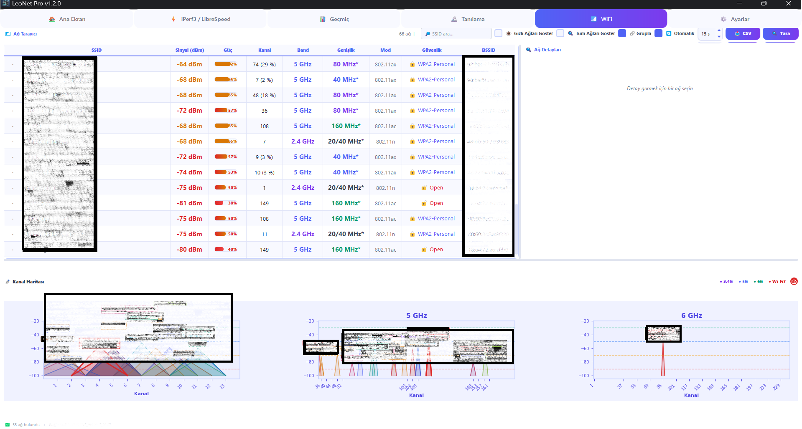
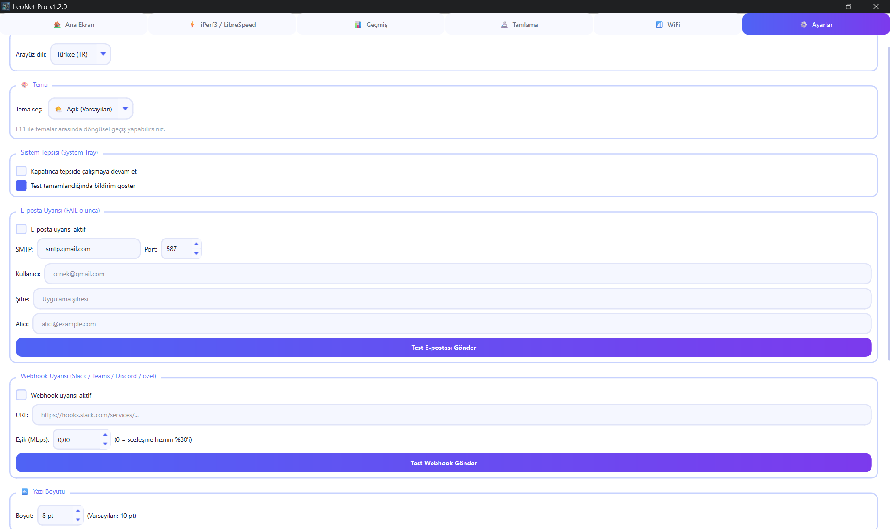

# LeoNet Pro v1.2.0 🦁

Windows 10/11 (64-bit) için ağ tanılama ve hız testi uygulaması. / Network diagnostics and speed testing for Windows 10/11 (64-bit).

## Türkçe

### v1.2.0 değişiklikleri

- **PySide6 / Qt 6 geçişi:** Arayüz PyQt5 yerine PySide6 kullanıyor.
- **Thread yaşam döngüsü:** Çalışan işçilerin referansları korunuyor; çıkışta işçilerin bitmesi bekleniyor.
- **Ping Monitor:** Start/Stop sırasında buton durumu güncelleniyor; işçi sonlanana kadar yeniden başlatma kısa süre devre dışı kalabilir.
- **Testlerin birlikte kullanımı:** Speedtest + Ping ve iPerf3 + Ping kullanılabilir. Özel iPerf dahil ağır hız testlerinin eşzamanlı başlatılması engellenir. Bufferbloat içeren tanılama paketi de ağır test olarak değerlendirilir.

- Tanılama ekranında ping için kaynak IPv4 / ağ kartı seçimi.
- Uygulama sağ tık menüsünden sık kullanılan işlemlere erişim.
- Dil değiştirildiğinde ping eşiği etiketinin **Uyarı / Alert** olarak yenilenmesi.
- GitHub güncelleme kontrolünde açıkça yüklenen CA sertifika paketiyle HTTPS doğrulaması; hata durumunda ayrıntılı günlük.

NIC seçimi destekleyen ping komutlarına kaynak IP ekler. Tüm uygulama trafiğini seçilen karta yönlendiren bir ayar değildir; Windows yönlendirmesi ve hedefin erişilebilirliği sonucu etkiler. Menü seçiminin çalışması, ağ paketlerinin belirli fiziksel karttan çıktığını tek başına kanıtlamaz.

### İndirme ve başlangıç

1. [Yayımlanmış sürümlerden](https://github.com/burakaslann/LeoNetPro/releases) kullanıma sunulmuş kurulum dosyasını indirin. v1.2.0 yayımlandığında dosya adı `LeoNetPro_Setup_v1.2.0.exe` olacaktır.
2. Kurulum dilini ve bileşenleri seçin. iPerf3 bileşeni seçiliyse kurulumun içerdiği iPerf3 paketi yüklenir. Tesseract seçeneği yalnızca hazırlanan pakette Tesseract yükleyicisi varsa görünür; OCR için ayrıca kurulmalıdır.
3. Ookla Speedtest CLI ayrı indirilir. `speedtest.exe` dosyasını LeoNet Pro EXE'sinin bulunduğu klasöre koyun; yeniden açın. [Resmî CLI sayfası](https://www.speedtest.net/apps/cli)
4. Manuel Cloudflare yedek testi CLI bulunmadığında kullanılabilir. Zamanlanmış hız testleri CLI gerektirir.

### Özellikler

- Ookla CLI hız testi, manuel Cloudflare yedek testi, iPerf3 istemci/sunucu ve LibreSpeed araçları.
- Ping izleme, bağlantı kesintisi geçmişi, paket kaybı, RTT değişkenliği, MTU ve yük altında gecikme tanılaması.
- DNS gecikmesi, Cloudflare üzerinden DNSSEC yanıt kontrolü, DoH/DoT erişim kontrolleri, çözücü IP gözlemi, traceroute ve port araçları.
- Wi-Fi BSSID tablosu, SSID arama, yeniden boyutlandırılabilir sütunlar, sinyal geçmişi ve kanal haritası.
- Bayt/süre hesabı, OCR, geçmiş, CSV/DB dışa aktarma ve PDF raporlama.
- Türkçe/İngilizce arayüz, altı tema, sistem tepsisi, isteğe bağlı e-posta/webhook bildirimleri.

### Ölçüm sınırları

Wi-Fi dBm değeri Windows sinyal yüzdesinden `floor(yüzde / 2) - 100` ile tahmin edilir. Tarama sonuçları gecikmeli veya önbellekten gelebilir. Kanal genişliği ve radyo yetenekleri tahmin olabilir; kanal numarası tek başına bandı kesin belirlemez. Kanal haritası spektrum analizörü değildir.

Tanılama jitter değeri ardışık ping RTT farklarının ortalamasıdır; RFC 3550 RTP jitter hesabı değildir. DNSSEC kontrolü Cloudflare DoH yanıtındaki AD bayrağını okur; ISP çözücüsünün doğrulamasını test etmez. Çözücü IP'si tek başına VPN sızıntısı kanıtı değildir. MTU, bufferbloat ve kalite skoru kullanılan hedeflere ve başarılı ölçüme bağlı göstergelerdir. PDF raporu TR-143 sertifikasyonu sağlamaz.

### Gizlilik ve veri

Test geçmişi yerel bilgisayarda tutulur. Test ve tanılama hizmetleri genel IP adresiniz gibi bağlantı bilgilerini ve işlem için gereken istekleri alır. E-posta/webhook bildirimleri etkinleştirildiğinde bildirim içeriği yapılandırılan hedeflere gönderilir.

- Kesinti izleyicisi uygulama açıldığında otomatik başlar ve bağlantıyı düzenli olarak kontrol eder.
- Güncelleme kontrolü açılışta otomatik olarak ve düğmeyle elle yapılabilir; başarılı otomatik kontrol günlük olarak önbelleklenir.
- Wi-Fi otomatik taraması varsayılan olarak açıktır; Windows ve sürücü davranışına bağlıdır.
- Zamanlanmış hız testleri etkinleştirildiğinde Ookla sunucularına bağlantı kurulur. Cloudflare yedek hız testi bu zamanlama yolunda kullanılmaz.
- Manuel hız testi ve tanılamada Ookla, Cloudflare, seçilen DNS/iPerf3/LibreSpeed sunucuları ve diğer tanılama hedefleriyle bağlantı kurulabilir.

Üçüncü tarafların kendi koşulları ve gizlilik politikaları geçerlidir. Arka planda hiçbir ağ bağlantısı kurulmadığı taahhüt edilmez.

Veritabanı: `%TEMP%\hiz_testleri.db`. Ana ayarlar: `HKCU\Software\BurakAslan\LeoNetPro` (QSettings). Geçici klasör temizliği geçmişi silebilir; yükseltmeden önce DB/CSV yedeği alın. Bildirim adresleri ve kimlik bilgileri uygulama ayarlarında bulunabilir; bunları paylaşmayın.

[Türkçe/İngilizce kullanım kılavuzu](USER_GUIDE.md) · [EULA](EULA.txt) · [Lisans bildirimleri](LICENSE.txt)

## English

### Changes in v1.2.0

- **PySide6 / Qt 6 migration:** The interface now uses PySide6 instead of PyQt5.
- **Thread lifecycle:** Running workers retain their references; application exit waits for them to finish.
- **Ping Monitor:** Start/Stop updates the button state; restarting may be briefly disabled while the worker finishes.
- **Concurrent tests:** Speedtest + Ping and iPerf3 + Ping can run together. Concurrent heavy speed tests, including custom iPerf, are blocked. The diagnostics suite includes bufferbloat and is also treated as a heavy test.

- Source IPv4 / network adapter selection for supported ping commands.
- Application context menu for common actions.
- The ping threshold label refreshes to **Alert / Uyarı** when changing language.
- GitHub update checks use an explicitly loaded CA bundle with HTTPS verification and detailed error logging.

Adapter selection sets the source IP for supported ping commands; it does not bind all application traffic to an adapter. Windows routing and target reachability still apply. Selecting an adapter in the UI alone does not verify the physical egress path.

### Download and setup

Use the [published releases](https://github.com/burakaslann/LeoNetPro/releases). Once v1.2.0 is published, its installer will be named `LeoNetPro_Setup_v1.2.0.exe`.

Choose the installer language and components. iPerf3 is installed when selected. The Tesseract option appears only when the package includes its installer; OCR requires Tesseract to be installed separately. Obtain [Ookla Speedtest CLI](https://www.speedtest.net/apps/cli) separately and place `speedtest.exe` beside the LeoNet Pro executable. Restart the app. Scheduled tests require the CLI; manual Cloudflare fallback is available when it is absent.

### Features and measurement limits

Speed tests, iPerf3 client/server, LibreSpeed tools, live ping, outage history, network diagnostics, Wi-Fi scanning and filtering, OCR, byte/time calculations, CSV/DB export and PDF reports are available. The UI offers Turkish/English, six themes, tray support and optional email/webhook alerts.

Wi-Fi dBm is estimated from Windows signal quality using `floor(percent / 2) - 100`. Scan data can be cached or delayed. Width and capabilities may be inferred; channel number alone does not conclusively identify a band. The channel map is not a spectrum analyzer.

Diagnostic jitter is the mean absolute difference between successive ping RTTs, not RFC 3550 RTP jitter. The DNSSEC check reads the Cloudflare DoH AD flag, not ISP resolver validation. Resolver IP observations alone do not prove a VPN leak. MTU, bufferbloat and quality scores are indicative and depend on successful measurements. PDF reports do not certify TR-143 compliance.

### Privacy and storage

Test history is stored locally. Test and diagnostic services receive connection information such as your public IP address and requests needed for each operation. When email/webhook alerts are enabled, notification content is sent to the configured destinations.

- The outage monitor starts with the application and checks connectivity periodically.
- Update checks can run automatically on launch or manually; a successful automatic check is cached for the day.
- Automatic Wi-Fi scanning is enabled by default and depends on Windows and driver behavior.
- Enabled scheduled speed tests contact Ookla servers. The Cloudflare fallback is not used by that scheduling path.
- Manual tests and diagnostics can contact Ookla, Cloudflare, selected DNS/iPerf3/LibreSpeed servers and other diagnostic targets.

Third parties have their own terms and privacy policies. The app does not promise that no background network activity occurs.

Database: `%TEMP%\hiz_testleri.db`. Main settings: `HKCU\Software\BurakAslan\LeoNetPro` (QSettings). Temporary-file cleanup may remove history; export DB/CSV backups before upgrading. Settings can contain notification destinations and credentials; do not share them.

[User guide](USER_GUIDE.md) · [EULA](EULA.txt) · [License notices](LICENSE.txt)

## License / Lisans

LeoNet Pro kapalı kaynaklıdır. Arayüz PySide6 / Qt 6 kullanır; LGPL kapsamındaki bileşenlerin hakları uygulama lisansından bağımsızdır. Ayrıntılar ve resmî kaynaklar: [LICENSE.txt](LICENSE.txt).

LeoNet Pro is proprietary. Its interface uses PySide6 / Qt 6; rights in LGPL-covered components are independent of the application license. Details and official references: [LICENSE.txt](LICENSE.txt).

Kişisel ve eğitim amaçlı kullanım ücretsizdir; ticari kullanım önceden yazılı izne tabidir. Üçüncü tarafların hakları kendi lisanslarına tabidir.

Personal and educational use is free; commercial use requires prior written permission. Third-party components remain subject to their own licenses.

Developed by **Burak Aslan** · [GitHub](https://github.com/burakaslann/LeoNetPro) · [LinkedIn](https://www.linkedin.com/in/burak-aslan-/)

### PDF ve çıkış düzeltmeleri / PDF and exit fixes

PDF raporlarında Türkçe karakterleri destekleyen gömülü DejaVu Sans kullanılır. Başlık satır aralıkları düzeltildi. Hız testi sırasında Ctrl+Q ile çıkış, çalışan Speedtest işlemini iptal eder. Tepsiye küçültme etkinse X düğmesi uygulamayı arka plana alabilir.

PDF reports embed DejaVu Sans for Turkish characters and use corrected heading spacing. Ctrl+Q cancels the active Speedtest process when exiting. With minimize-to-tray enabled, the X button may keep the application running in the tray.

## Ekran Görüntüleri / Screenshots

Görseller Türkçe arayüzü göstermektedir. / Screenshots show the Turkish interface.

### Ana Ekran / Main

### iPerf3 / LibreSpeed

### Geçmiş / History

### Tanılama / Diagnostics

### Wi-Fi

### Ayarlar / Settings

